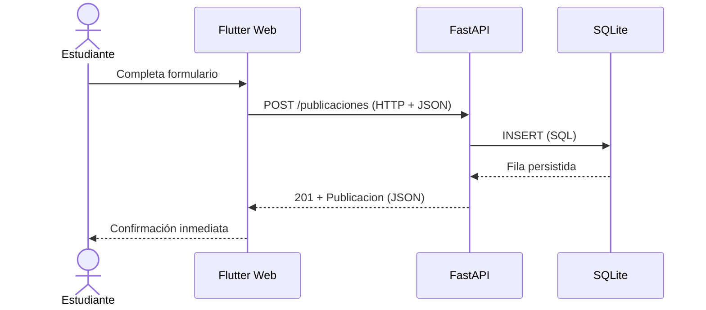
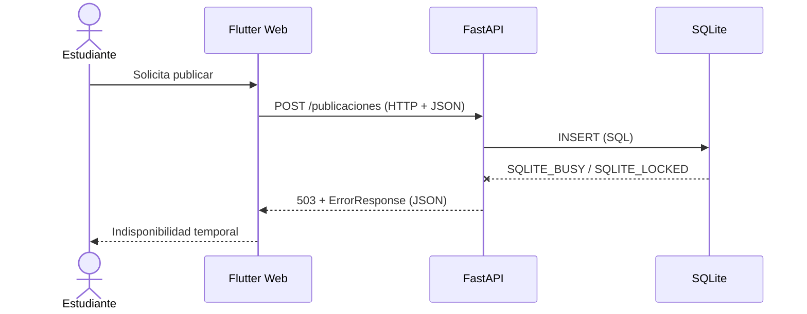

# 6. Vista de ejecución

## 6.1 Crear una publicación - flujo exitoso

El corte vertical de la Semana 4 implementa el caso de uso **crear una publicación de producto**.

1. El estudiante abre el formulario Flutter ubicado en `frontend/campusmarket/lib/publicaciones/publicacion_form_page.dart`.
2. La interfaz valida los campos básicos y envía `POST /publicaciones` mediante
   HTTP con cuerpo `application/json`, de acuerdo con OpenAPI `1.0.0`.
3. FastAPI recibe la solicitud en `backend/app/publicaciones/router.py`.
4. El servicio `backend/app/publicaciones/service.py` normaliza los datos del caso de uso.
5. `backend/app/publicaciones/repository.py` guarda la publicación en SQLite.
6. El backend devuelve `201 Created` con un JSON que cumple el esquema
   `Publicacion`, incluida la propiedad `id`.
7. Flutter informa al estudiante que la publicación fue creada.

La interacción Flutter-FastAPI es síncrona: ambos deben estar disponibles al
mismo tiempo y el usuario espera una respuesta inmediata. La justificación y
los modos de fallo están registrados en
[ADR-0003](../adr/0003-usar-integracion-sincrona-http-json.md).

## 6.2 Consultar publicaciones

1. Flutter envía `GET /publicaciones` mediante HTTP.
2. FastAPI solicita al módulo Publicaciones recuperar los registros.
3. El repositorio ejecuta `SELECT` mediante SQL sobre SQLite.
4. El backend responde `200 OK` con `application/json` y un arreglo de objetos
   `Publicacion` conforme al contrato OpenAPI.
5. Flutter presenta el listado al estudiante.

## 6.3 Crear una publicación - persistencia no disponible

1. Flutter envía `POST /publicaciones` con un `PublicacionCreate` en JSON.
2. SQLite permanece bloqueada durante la escritura.
3. El repositorio espera como máximo `0.5 s` y propaga una indisponibilidad
   específica sin confirmar una escritura parcial.
4. FastAPI responde HTTP `503` con `application/json` conforme al esquema
   `ErrorResponse`.
5. Flutter informa al usuario que la persistencia está temporalmente no
   disponible y conserva la posibilidad de reintentar.

Este modo de fallo conserva EC-05: respuesta `503` en `≤ 2 s`, sin escritura
parcial y con recuperación posterior.

## 6.4 Verificación automatizada

`backend/tests/test_publicaciones_vertical.py` ejecuta el recorrido HTTP → lógica → persistencia utilizando una base SQLite temporal. La prueba crea una publicación, comprueba que el archivo de persistencia exista y vuelve a consultar las publicaciones para verificar que el dato guardado pueda recuperarse.

Este escenario evidencia que las cajas principales del C4 Nivel 2 tienen una implementación correspondiente y que el flujo documentado es ejecutable.

La correspondencia entre la superficie HTTP documentada y la implementación
se verifica además en
[`backend/tests/test_contrato_openapi.py`](../../backend/tests/test_contrato_openapi.py).
La prueba compara el contrato versionado `contracts/openapi-v1.json` con el
esquema OpenAPI del proveedor FastAPI y se ejecuta como paso explícito del
pipeline.
