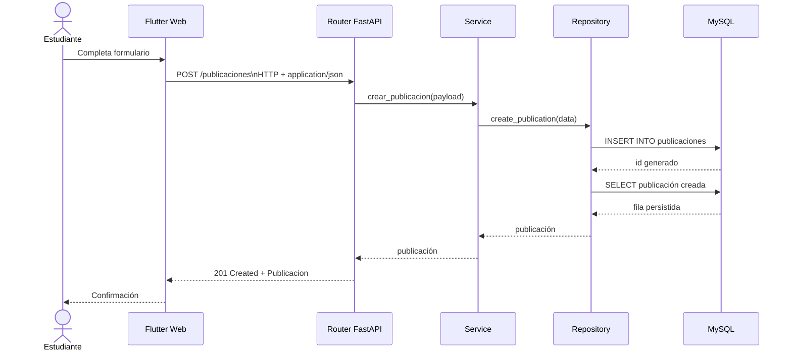
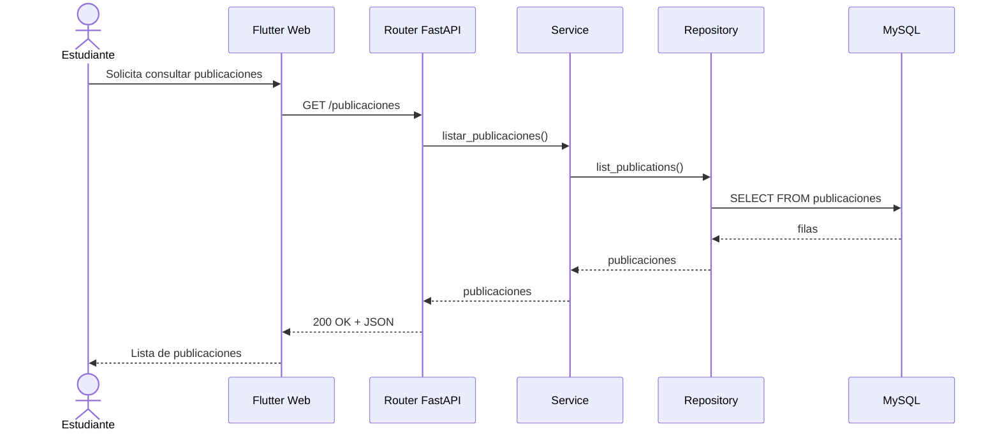
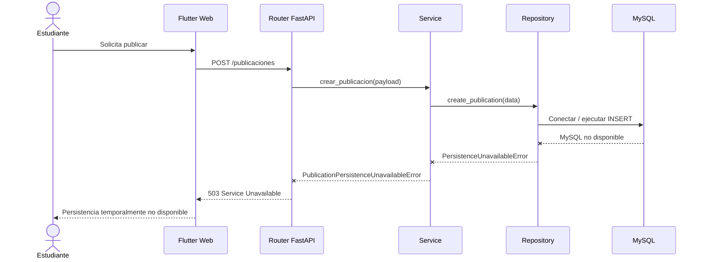

# 6. Vista de ejecución

## 6.1 Crear una publicación - flujo exitoso

El corte vertical materializado implementa el caso de uso
**crear una publicación de producto**.

1. El estudiante abre el formulario Flutter ubicado en
   `frontend/campusmarket/lib/publicaciones/publicacion_form_page.dart`.
2. La interfaz valida los campos básicos y envía `POST /publicaciones`
   mediante HTTP con cuerpo `application/json`, de acuerdo con el contrato
   OpenAPI `1.0.0`.
3. FastAPI recibe la solicitud en
   `backend/app/publicaciones/router.py`.
4. El router valida el payload y delega la operación al servicio.
5. `backend/app/publicaciones/service.py` normaliza los datos del caso de uso.
6. `backend/app/publicaciones/repository.py` abre una conexión a MySQL mediante
   PyMySQL.
7. El repositorio ejecuta el `INSERT` sobre la tabla `publicaciones`.
8. La transacción se confirma mediante `commit`.
9. El registro creado se recupera desde MySQL.
10. El backend devuelve `201 Created` con un JSON que cumple el esquema
    `Publicacion`, incluida la propiedad `id`.
11. Flutter informa al estudiante que la publicación fue creada.



La interacción Flutter → FastAPI es **síncrona**: el consumidor realiza una
solicitud y espera la respuesta HTTP dentro de la misma interacción.

La decisión arquitectónica que justifica esta integración se encuentra en:

[ADR-0003 - Integración síncrona HTTP/JSON](../adr/0003-usar-integracion-sincrona-http-json.md)

---

## 6.2 Consultar publicaciones

El flujo de consulta actualmente materializado es:

1. Flutter envía `GET /publicaciones`.
2. FastAPI recibe la solicitud en el router del contexto Publicaciones.
3. El router delega la operación al servicio.
4. El servicio solicita los datos al repositorio.
5. El repositorio abre una conexión a MySQL mediante PyMySQL.
6. El repositorio ejecuta un `SELECT` sobre la tabla `publicaciones`.
7. MySQL devuelve los registros disponibles.
8. El backend responde `200 OK` con `application/json`.
9. La respuesta contiene un arreglo de objetos `Publicacion` conforme al
   contrato OpenAPI.
10. Flutter presenta el listado al estudiante.



---

## 6.3 Persistencia temporalmente no disponible

La arquitectura conserva un comportamiento controlado cuando la persistencia
MySQL no puede ser alcanzada temporalmente.

El flujo es:

1. Flutter envía `POST /publicaciones` con un `PublicacionCreate` en JSON.
2. El router delega la operación al servicio.
3. El servicio solicita la persistencia al repositorio.
4. El repositorio intenta establecer la conexión con MySQL.
5. Si la conexión o la operación de persistencia falla, PyMySQL produce una
   excepción de acceso a base de datos.
6. El repositorio traduce dicha condición a
   `PersistenceUnavailableError`.
7. El servicio la traduce a
   `PublicationPersistenceUnavailableError`.
8. El router devuelve HTTP `503 Service Unavailable`.
9. El cliente recibe un `ErrorResponse` en JSON.
10. La escritura no se presenta como exitosa.



Este comportamiento mantiene la degradación controlada del sistema sin exponer
al cliente detalles internos del motor de base de datos.

La API devuelve un mensaje HTTP estable aunque la causa técnica interna sea una
falla de conexión o disponibilidad de MySQL.

---

## 6.4 Transacciones y consistencia

El repositorio utiliza transacciones explícitas para las operaciones de
escritura.

En una creación exitosa:

```text
Conexión MySQL
    ↓
INSERT
    ↓
SELECT del registro creado
    ↓
COMMIT
```

Ante un error durante una operación de escritura:

```text
Conexión MySQL
    ↓
Operación SQL
    ↓
Error
    ↓
ROLLBACK
    ↓
Error controlado hacia capas superiores
```

De esta manera, el resto de la aplicación no necesita conocer detalles
específicos de transacciones o del driver de MySQL.

---

## 6.5 Verificación automatizada del corte vertical

La integración del recorrido:

```text
HTTP
 ↓
Router
 ↓
Service
 ↓
Repository
 ↓
MySQL
```

se verifica mediante:

[`backend/tests/test_publicaciones_vertical.py`](../../backend/tests/test_publicaciones_vertical.py)

La prueba valida actualmente:

* creación de una publicación mediante `POST /publicaciones`;
* respuesta HTTP `201`;
* recuperación posterior mediante `GET /publicaciones`;
* persistencia real del registro en MySQL;
* correspondencia entre el dato creado y el dato recuperado;
* respuesta controlada HTTP `503` cuando la persistencia no está disponible.

La prueba ya no depende de un archivo SQLite temporal.

---

## 6.6 Verificación del contrato OpenAPI

La correspondencia entre la superficie HTTP documentada y la implementación se
verifica mediante:

[`backend/tests/test_contrato_openapi.py`](../../backend/tests/test_contrato_openapi.py)

El contrato versionado se encuentra en:

`contracts/openapi-v1.json`

La prueba compara la especificación versionada con el esquema OpenAPI generado
por FastAPI.

De esta manera, el contrato no se verifica únicamente mediante inspección
manual.

La relación esperada es:

```text
Contrato OpenAPI
       ↕
Implementación FastAPI
       ↕
Prueba automatizada
```

---

## 6.7 Relación con C4

Los flujos de esta sección corresponden directamente a los elementos
documentados en C4.

### C4 Nivel 2

```text
Flutter Web
    ↓ HTTP/JSON
Backend API
    ↓ PyMySQL / SQL
MySQL
```

### C4 Nivel 3

```text
API de Publicaciones
        ↓
Servicio de Publicaciones
        ↓
Repositorio de Publicaciones
        ↓
MySQL
```

La Vista de Ejecución complementa estos diagramas mostrando el comportamiento
dinámico de los componentes durante cada escenario.

---

## 6.8 Evolución respecto al primer corte

Durante el primer corte, CampusMarket utilizaba SQLite como persistencia.

En ese contexto se documentó y verificó un modo de fallo específico asociado a
bloqueos temporales de SQLite.

Esa evidencia histórica se conserva en:

* ADR-0002;
* pruebas y mediciones del primer corte;
* scripts de medición de bloqueo;
* evidencias correspondientes.

La persistencia vigente es **MySQL**, por lo que los escenarios actuales se
describen en términos de disponibilidad de MySQL y no de condiciones
`SQLITE_BUSY` o `SQLITE_LOCKED`.

La evolución conserva la intención arquitectónica de degradación controlada,
pero adapta su implementación a la tecnología vigente.
