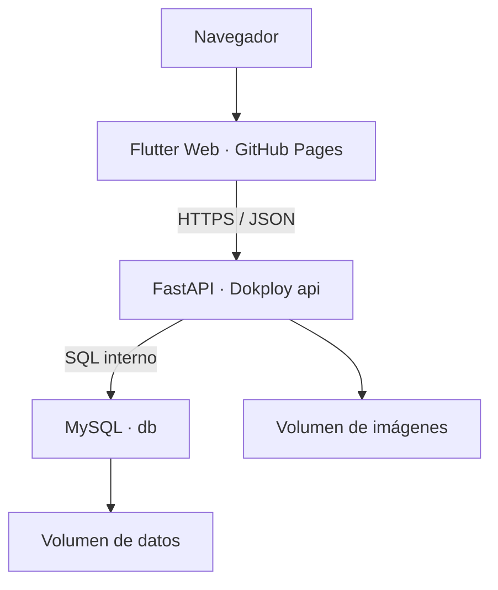

# 7. Vista de despliegue - CampusMarket

## 7.0 Despliegue público MVP — 2026-10-04

Fuente publicada: `c38e0cf36a30dddec39f169b7618b7c6127e0a71`.
La línea S8 de las secciones posteriores conserva su significado histórico.

| Pieza | Entorno vigente | Evidencia y límite |
|---|---|---|
| Sitio Flutter Web | GitHub Pages del fork Nnigarp | Build release con API Dokploy, marcador source-revision.txt y prueba de Inicio/detalle |
| API modular FastAPI | Dokploy, servicio sistema/api, 256M y 0.50 CPU | HTTPS https://campusmarket.iscoutb.dev, /health 200 y 23 checks HTTP |
| Base de datos MySQL 8.4 | servicio db del mismo Compose, 256M y 0.50 CPU | Host interno db:3306; volumen mysql_data; sin puerto público |
| Archivos | volumen publication_images montado en /app/backend/uploads | PNG creado/descargado; persistencia tras recreación pública pendiente |
| Trabajos programados | Ninguno requerido por el MVP actual | No se despliega servicio adicional |
| Pipeline | Cuatro workflows oficiales + publicación Pages desde SHA aprobado | Runs citados en evidencia; scanner Sonar CI aún pendiente según contrato |



El proxy Traefik termina HTTPS. CORS acepta https://nnigarp.github.io.
El Compose versionado no añade redes externas; Dokploy genera la red y labels
del servicio. Mantener Isolated Deployment. No hay bind mounts, puertos publicados,
Docker socket ni privilegios en el archivo del proyecto.

[ADR-0016](../adr/0016-ajustar-recursos-a-la-cuota-del-laboratorio.md) y
[ADR-0018](../adr/0018-ejecutar-el-monolito-en-dokploy-con-volumenes.md) conservan
sus versiones aceptadas. Este despliegue ejecuta la elección ya documentada.
[Resultados y pendientes públicos](../evidencias/despliegue-publico-mvp-2026-10-04.md).

Reproducción: desplegar el SHA citado mediante sistema, Provider GitHub,
Compose Path ./deploy/compose.lab.yaml, secretos en Environment, dominio
campusmarket.iscoutb.dev hacia api:8000 y HTTPS. Pages se compila en Actions,
fuera del laboratorio, mediante publicar-mvp-aprobado.yml del fork.
No usar Fresh Volumes para reconstruir.

El rollback de aplicación usa una revisión anterior compatible con los datos,
sin eliminar volúmenes. No se ejecutó un rollback público.
La guía no garantiza backups. Reinicio público fue rechazado por permisos Docker;
redeploy normal conservó la muestra, pero no recreó contenedores.
CI sí demuestra recreación/persistencia en su entorno, por separado.

## 7.1 Estado desplegado en S8

Durante S8 CampusMarket se despliega en un entorno público y verificable.

La solución desplegada está compuesta por:

- **Flutter Web** publicado mediante GitHub Pages.
- **FastAPI / Python 3.12** desplegado en Azure App Service.
- **MySQL 8.4** desplegado mediante Azure Database for MySQL Flexible Server.
- comunicación pública mediante **HTTPS**;
- infraestructura de Azure declarada mediante **Bicep**;
- configuración sensible suministrada mediante configuración del entorno, sin versionar credenciales reales en el repositorio.

### URLs públicas

Frontend:

`https://nnigarp.github.io/AS_202620_PROYECTO_CAMPUSMARKET/`

Backend:

`https://campusmarket-s8-api-nilver.azurewebsites.net`

Health check:

`https://campusmarket-s8-api-nilver.azurewebsites.net/health`

---

## 7.2 Topología desplegada

```text
Usuario
   |
   | HTTPS
   v
GitHub Pages
Flutter Web
   |
   | HTTPS / JSON
   v
Azure App Service
FastAPI
   |
   | TLS / SQL
   v
Azure Database for MySQL
Flexible Server
```

El frontend no accede directamente a la base de datos.

El acceso a persistencia continúa encapsulado por el backend y conserva la dirección arquitectónica:

```text
Flutter Web
    |
    v
FastAPI
    |
    v
router
    |
    v
service
    |
    v
repository
    |
    v
PyMySQL
    |
    v
MySQL
```

Esta topología mantiene las fronteras del monolito modular definidas previamente y modifica principalmente la infraestructura de ejecución.

---
### Mapeo explícito pieza → plataforma

La vista de despliegue de S8 trata cada pieza de CampusMarket de forma
independiente.

```text
┌─────────────────────────────────────────────┐
│ PIEZA 1 · FRONTEND                          │
│ Flutter Web                                 │
│                                             │
│ Ejecuta en: GitHub Pages                    │
│ Publicación: rama gh-pages                  │
│ Protocolo de salida: HTTPS / JSON           │
│ ADR: ADR-0006                               │
└─────────────────────────────────────────────┘
                     │
                     │ HTTPS / JSON
                     ▼
┌─────────────────────────────────────────────┐
│ PIEZA 2 · BACKEND API                       │
│ FastAPI / Python 3.12                       │
│                                             │
│ Ejecuta en: Azure App Service               │
│ App: campusmarket-s8-api-nilver             │
│ Health: GET /health                         │
│ ADR: ADR-0007                               │
└─────────────────────────────────────────────┘
                     │
                     │ TLS / SQL
                     ▼
┌─────────────────────────────────────────────┐
│ PIEZA 3 · PERSISTENCIA                      │
│ MySQL 8.4                                   │
│                                             │
│ Ejecuta en: Azure Database for MySQL        │
│              Flexible Server                │
│ Base: campusmarket                          │
│ ADR: ADR-0008                               │
└─────────────────────────────────────────────┘

## 7.3 Frontend

El frontend está desarrollado con **Flutter Web**.

Su publicación pública se realiza mediante **GitHub Pages** utilizando la rama:

`gh-pages`

La URL pública es:

`https://nnigarp.github.io/AS_202620_PROYECTO_CAMPUSMARKET/`

Durante el build de producción, la dirección del backend se proporciona mediante:

`CAMPUSMARKET_API_BASE_URL`

El build utilizado para S8 se genera indicando la API pública de Azure.

La comunicación entre Flutter Web y FastAPI utiliza:

**HTTPS / JSON**

El origen público de GitHub Pages se encuentra autorizado explícitamente mediante la configuración CORS del backend.

---

## 7.4 Backend

El Backend API se encuentra desplegado en **Azure App Service** sobre Linux.

Características principales:

- tecnología: FastAPI;
- lenguaje: Python 3.12;
- servidor ASGI: Uvicorn;
- región utilizada: Mexico Central;
- HTTPS habilitado;
- configuración mediante variables de entorno.

Aplicación desplegada:

`campusmarket-s8-api-nilver`

URL:

`https://campusmarket-s8-api-nilver.azurewebsites.net`

Comando de inicio:

```text
python -m uvicorn backend.app.main:app --host 0.0.0.0 --port 8000
```

El endpoint operativo principal es:

`GET /health`

Durante la validación real del despliegue se obtuvo:

```text
HTTP 200
{"status":"ok","service":"campusmarket-api"}
```

---

## 7.5 Persistencia

La persistencia vigente utiliza:

**Azure Database for MySQL Flexible Server**

Configuración relevante del prototipo S8:

- MySQL 8.4;
- región Mexico Central;
- SKU Burstable `Standard_B1ms`;
- 1 vCore;
- 2 GiB de memoria;
- almacenamiento de 32 GiB;
- alta disponibilidad deshabilitada para el prototipo académico;
- comunicación TLS habilitada.

La base de datos utilizada por CampusMarket es:

`campusmarket`

El acceso desde FastAPI se realiza mediante **PyMySQL**.

Las credenciales de producción no se almacenan en el repositorio.

---

## 7.6 Infraestructura como código

Los recursos principales del entorno Azure están declarados mediante **Bicep** en:

`infra/main.bicep`

La plantilla incluye, entre otros:

- App Service Plan;
- Web App para FastAPI;
- MySQL Flexible Server;
- base de datos `campusmarket`;
- reglas de acceso necesarias;
- configuración de la aplicación;
- parámetros para información sensible.

La contraseña administrativa de MySQL se recibe mediante un parámetro marcado como seguro y no se almacena directamente en el archivo.

La plantilla fue compilada mediante:

```text
az bicep build --file main.bicep
```

La infraestructura también fue validada mediante:

```text
az deployment group validate
```

La validación produjo:

```text
provisioningState: Succeeded
error: null
```

Esto permite comprobar que la definición de infraestructura es válida y reproducible sin almacenar secretos reales.

---

## 7.7 Salud y observabilidad

CampusMarket incorpora mecanismos operativos para comprobar el estado del sistema.

### Health check

Endpoint:

`GET /health`

Comportamiento verificado:

- MySQL disponible → HTTP `200`, estado `ok`;
- MySQL no disponible → HTTP `503`, estado degradado;
- MySQL recuperado → retorno a HTTP `200`.

Este comportamiento permite distinguir entre una API activa con persistencia disponible y una degradación causada por la indisponibilidad de MySQL.

### Logs estructurados

Las solicitudes HTTP generan registros estructurados con información como:

- timestamp;
- nivel;
- evento;
- request ID;
- método HTTP;
- ruta;
- código de estado;
- duración en milisegundos.

Los logs fueron observados durante la ejecución real del App Service.

### Métrica asociada a EC-01

El backend dispone de:

`GET /ops/metrics/ec01`

Durante la medición realizada en S8 se registraron:

- 10 solicitudes observadas;
- 10 solicitudes dentro del objetivo de 2000 ms;
- cumplimiento del objetivo del backend en la muestra.

Esta medición corresponde al recorrido del backend y se utiliza como indicador operativo de EC-01.

No se presenta como validación completa del escenario de usuario extremo a extremo.

---

## 7.8 Verificación funcional del despliegue

El despliegue fue validado mediante el corte vertical real:

```text
GitHub Pages
    ↓
Flutter Web
    ↓ HTTPS / JSON
Azure App Service
    ↓
FastAPI
    ↓
MySQL Azure
```

Desde la URL pública de Flutter Web se creó correctamente una publicación.

La interfaz mostró:

```text
Publicación #2 guardada correctamente.
```

Esto permitió verificar que el recorrido público atraviesa:

- frontend desplegado;
- CORS;
- API desplegada;
- lógica de aplicación;
- repositorio;
- conexión TLS;
- MySQL.

También se verificó que:

`GET /publicaciones`

recupera publicaciones almacenadas en la base de datos desplegada.

---

## 7.9 Despliegue reproducible

### Backend

El backend puede desplegarse a partir de un commit conocido mediante:

```text
git archive --format=zip -o campusmarket-s8.zip <COMMIT>
```

y posteriormente:

```text
az webapp deploy \
  --resource-group rg-campusmarket-s8 \
  --name campusmarket-s8-api-nilver \
  --src-path campusmarket-s8.zip \
  --type zip
```

Después del despliegue debe verificarse:

```text
GET /health
```

y los endpoints del corte vertical.

### Frontend

El frontend se genera mediante:

```text
flutter analyze
```

y:

```text
flutter build web --release \
  --dart-define=CAMPUSMARKET_API_BASE_URL=https://campusmarket-s8-api-nilver.azurewebsites.net \
  --base-href "/AS_202620_PROYECTO_CAMPUSMARKET/"
```

El contenido de:

`build/web`

se publica posteriormente mediante la rama:

`gh-pages`

La publicación se verifica mediante GitHub Pages y mediante una prueba funcional desde navegador.

---

## 7.10 Rollback

El rollback del backend consiste en volver a desplegar un commit previamente conocido y validado.

Ejemplo:

```text
git archive --format=zip \
  -o campusmarket-rollback.zip \
  <KNOWN_GOOD_SHA>
```

Posteriormente:

```text
az webapp deploy \
  --resource-group rg-campusmarket-s8 \
  --name campusmarket-s8-api-nilver \
  --src-path campusmarket-rollback.zip \
  --type zip
```

Después del rollback deben verificarse nuevamente:

- `/health`;
- `GET /publicaciones`;
- creación de publicación desde el frontend.

Para el frontend, el rollback consiste en republicar en `gh-pages` un `build/web` correspondiente a una versión previamente validada.

---

## 7.11 Seguridad de configuración

Las credenciales reales de MySQL no se almacenan en el código ni en la infraestructura versionada.

La configuración sensible se proporciona mediante:

- parámetros seguros de Bicep;
- App Settings de Azure;
- variables de entorno.

La plantilla utiliza un parámetro seguro para la contraseña administrativa de MySQL.

La comunicación pública utiliza HTTPS y la comunicación entre backend y MySQL utiliza TLS.

---

## 7.12 Evidencia verificable de S8

Durante S8 se verificó:

- frontend público mediante GitHub Pages;
- backend público mediante Azure App Service;
- MySQL desplegado en Azure;
- health check HTTP `200`;
- degradación HTTP `503` sin base de datos;
- recuperación posterior a HTTP `200`;
- CORS desde el origen público;
- creación real de una publicación desde Flutter Web;
- persistencia real en MySQL;
- logs estructurados;
- métrica operacional de EC-01;
- pipeline de pruebas del backend en verde;
- pipeline de GitHub Pages en verde;
- infraestructura Azure versionada mediante Bicep;
- validación satisfactoria de la plantilla Bicep.

La vista de despliegue describe el entorno efectivamente ejecutado durante S8 y reemplaza la descripción anterior en la que el proveedor cloud todavía se encontraba pendiente.
